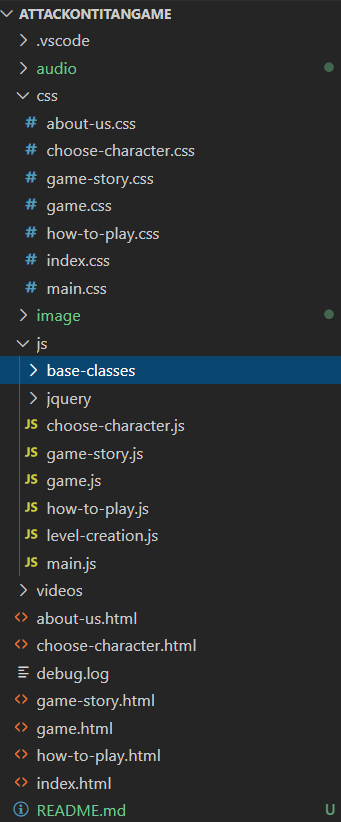

# Attack On Titans game 

<p align="center">


</p>


# Team Members

## Omar Awad.
## Hossam Radwan.
## Christen George.
## Ahmed Eldakhly.
            
#

# Deployment Link.
[Attack on titans game](https://omarmohamedawad.github.io/test/)

#

# Pages

## Home page.
The entry point of the game that can be used to see all other pages or play the game.


## Start Game page.
By this page we can select the character and the level of the game and start the game.


## How To Play page.
Display instructions to play the game.


## About Us page.
Display information about the game and the owners.


## Story page.
give some information about the game story from the anime series.


# Structure Digrams.


# Project files arrangement.
This project consist of:

1 - HTML files in main folder.

2 - CSS files in css folder.

3 - JavaScript & jQuery files in js folder with sub-folder for base classes.

4 - A video in videos folder.

5 - Images in image folder with many sub-folders.

6 - audios in audio folder.

# Project files tree.


# Samples of codes.
Sample for HTML files.
```
<!DOCTYPE html>

<head>
    <link rel="stylesheet" href='https://fonts.googleapis.com/css?family=Berkshire Swash'>
    <link rel="icon" href="image/small-logo-with-shadow.png" type="image/icon type">
    <link rel="stylesheet" href="css/main.css">
    <link rel="stylesheet" href="css/game.css">
    <title>Attack On Titan</title>
</head>

<body>
    <div id='health'>
        <p id='healthName'>Health:</p>
        <div id="healthBar">.</div>
    </div>
    
    <div id="game"></div>
    
    <div class="divTimer">
        <p>End in: <span class="js-timeout">0:45</span></p>
    </div>
    <div class="speaker">
        
    </div>
    <!--  -->
    <script src="js/jquery/jquery-3.5.1.js"></script>
    <script src="js/base-classes/enemy.js"></script>
    <script src="js/base-classes/level-structure.js"></script>
    <script src="js/base-classes/Injection.js"></script>
    <script src="js/base-classes/background.js"></script>
    <script src="js/base-classes/building.js"></script>
    <script src="js/base-classes/character.js"></script>
    <script src="js/level-creation.js"></script>
    <script src="js/main.js"></script>
    <script src="js/game.js"></script>
</body>

</html>
```
Sample for CSS files.
```
body {
    padding: 0;
    margin: 0;
    background-size: cover;
    background-repeat: no-repeat;
    font-family: "Berkshire Swash", cursive;
    overflow: hidden;
 }
  html{
    margin:0;
    height:100%;
}
  
.speaker{
    background: rgba(33, 34, 34, 0.9);
    color: white;
    position: absolute;
    z-index: 5;
    border-radius: 10px;
    width: 50px;
    height: 50px;
    top: 38px;
    right: 50px;
    padding-left: 0;
}

.speaker img {
    margin: 7px;
}

  #icon {
    position: absolute;
    top: 20px;
    left: 20px;
    height:4px;
    width:4px;
  }
```
Sample for JavaScript files.
```
class Building extends LevelStructure {

    constructor(images, width, height, positionX, positionY) {
        super(images, width, height, positionX, positionY);
        $("#game").append("</img>");
        $("#build" + this.id).attr('src', "image/buildings/" + images);
        $("#build" + this.id).css({
            "left": positionX,
            "bottom": positionY,
            "width": width,
            "height": height,
            "z-index": 3
        });
    }

    static buildingsMovement() {
        $(".build-img").each((i) => {
            var position = parseInt($(".build-img")[i].style.left);
            if (position < - parseInt($(".build-img").css('width'))) {
                position = window.outerWidth;
            }

            $(".build-img")[i].style.left = position - 30 + "px";
        })
    }
}
``` 

#
